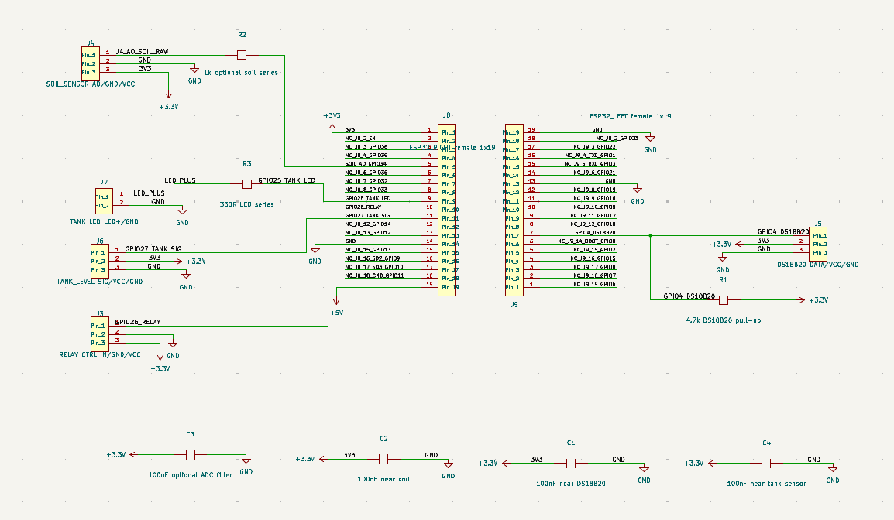
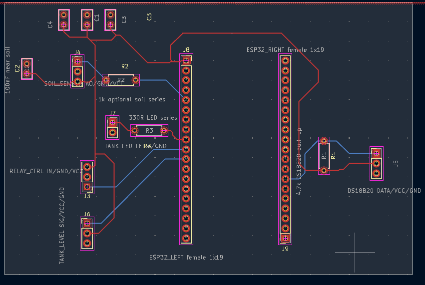
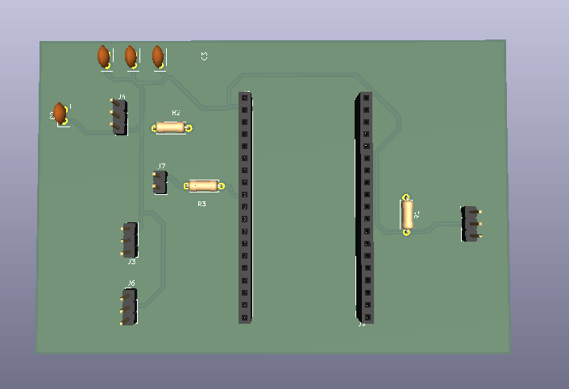
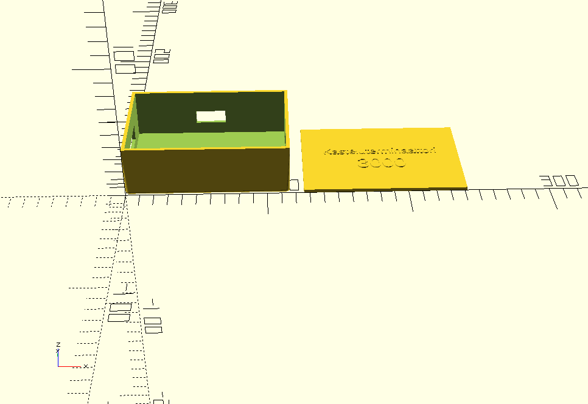

# Watering System

ESP32- ja ESP-IDF-pohjainen automaattinen kastelujärjestelmä. Järjestelmä
mittaa maan kosteutta ja ulkolämpötilaa, tarkkailee vesisäiliön tasoa ja ohjaa
vesipumppua releen kautta. Mittaus- ja ohjaustiedot välitetään MQTT:lla.

Tämä README sisältää kokoamis-, asennus-, kalibrointi-, käyttö- ja
GitHub-ohjeet, joiden avulla toinen käyttäjä voi ottaa projektin käyttöön.

## Sisältö

- [Toimintaperiaate](#toimintaperiaate)
- [Tarvittavat osat](#tarvittavat-osat)
- [Kytkennät](#kytkennät)
- [Ohjelmiston asennus](#ohjelmiston-asennus)
- [Asetukset](#asetukset)
- [Kalibrointi](#kalibrointi)
- [MQTT-käyttö](#mqtt-käyttö)
- [Testaus](#testaus)
- [PCB- ja kotelotiedostot](#pcb--ja-kotelotiedostot)
- [Vianhaku](#vianhaku)

## Toimintaperiaate

ESP32 suorittaa seuraavaa toimintalogiikkaa:

1. Laite käynnistää releen pois päältä, alustaa anturit ja yhdistää 2,4 GHz
   Wi-Fi-verkkoon sekä MQTT-brokeriin.
2. Maankosteusanturista luetaan useita ADC-näytteitä ja niiden keskiarvo.
3. Jos ADC-arvo ylittää kuivuusrajan riittävän monta peräkkäistä kertaa, maa
   tulkitaan kuivaksi.
4. Pumppu käynnistetään vain, jos pumpun ohjaus on sallittu, kastelujen välinen
   turva-aika on kulunut ja säiliöanturi ei ilmoita veden olevan vähissä.
5. Pumppu käy asetetun ajan ja sammuu automaattisesti.
6. DS18B20-lämpötila, maankosteus, säiliön tila ja pumpun tila julkaistaan
   MQTT:lla.
7. Pumppua, mittausta ja kasteluaikaa voi ohjata myös MQTT-komennoilla.

Säiliön tila `LOW` estää sekä automaattisen että manuaalisen pumppauksen.
Tila `UNKNOWN` ei nykyisessä ohjelmassa estä pumppausta. Jos säiliöanturi ei ole
kytketty tai toimii väärin, pumppua saa käyttää vain valvotusti.

Releohjaus on active-low:

- `GPIO26 = HIGH`: rele ja pumppu pois päältä
- `GPIO26 = LOW`: rele ja pumppu päällä

Kastelujen välinen turva-aika tallennetaan vain ESP32:n muistiin. Laitteen
uudelleenkäynnistys nollaa viimeisen kastelun ajan.

## Projektin rakenne

| Polku | Sisältö |
| --- | --- |
| [`main/`](main/) | ESP32-ohjelmiston lähdekoodi ja asetukset |
| [`hardware/pcb/`](hardware/pcb/) | KiCad-projekti ja piirilevyn lähdetiedostot |
| [`hardware/enclosure/`](hardware/enclosure/) | OpenSCAD-kotelomalli |
| [`PCB_OHJE.md`](PCB_OHJE.md) | PCB:n yksityiskohtaiset suunnitteluohjeet |
| [`GITHUB_OHJE.md`](GITHUB_OHJE.md) | Git- ja GitHub-työskentelyohje |
| `pump_test_values_backup_2026-04-10.txt` | Aiemmat pumpun testiasetukset |

## Tarvittavat osat

Pakolliset osat:

- ESP32 DevKit, jota ESP-IDF tukee
- kapasitiivinen maankosteusanturi, analoginen `0-3,0 V` ulostulo
- active-low-yhteensopiva 1-kanavainen 5 V relemoduuli
- 3-5 V DC-vesipumppu ja sopiva letku
- kapasitiivinen säiliön tasoanturi digitaalisella ulostulolla
- virtalähde pumpulle ja releelle
- johdot ja liittimet

Suositellut tai valinnaiset osat:

- DS18B20-lämpötila-anturi
- `4,7 kOhm` vastus DS18B20 DATA-linjan ja `3V3`:n väliin
- LED ja `330 Ohm` sarjavastus säiliön alhaisen tason ilmaisimeksi
- `100 nF` ohituskondensaattorit antureiden syöttöihin
- projektin KiCad-piirilevy ja 3D-tulostettu kotelo

Katso tarkempi komponentti- ja liitinluettelo tiedostosta
[`PCB_OHJE.md`](PCB_OHJE.md).

## Kytkennät

### ESP32-signaalit

| Toiminto | ESP32-pinni | Huomio |
| --- | --- | --- |
| Releen ohjaus | `GPIO26` | Active-low |
| Maankosteusanturin AO | `GPIO34` | ADC1 channel 6, enintään 3,3 V |
| DS18B20 DATA | `GPIO4` | `4,7 kOhm` pull-up vastus `3V3`:een |
| Säiliön tasoanturin signaali | `GPIO27` | Oletuksena HIGH tarkoittaa vettä |
| Säiliön tason LED | `GPIO25` | Oletuksena LED syttyy, kun säiliö on LOW |

### Peruskytkentä

- Kytke ESP32:n, relemoduulin, antureiden ja pumpun virtalähteen maat yhteen.
- Kytke maankosteusanturi `3V3`:een. Älä syötä yli 3,3 V signaalia
  `GPIO34`:aan.
- Kytke DS18B20 `3V3`:een ja lisää DATA-linjalle `4,7 kOhm` pull-up-vastus.
- Kytke relemoduulin `IN` pinniin `GPIO26`.
- Kytke pumpun virtapiiri releen `COM`- ja `NO`-kontaktien kautta.
- Kytke säiliöanturi valmistajan pinijärjestyksen mukaisesti. Tarkista
  johdinvärit ennen virran kytkemistä.

Tarkat netit, liittimet, jännitteet ja PCB-layout-ohjeet ovat tiedostossa
[`PCB_OHJE.md`](PCB_OHJE.md).

## Ohjelmiston asennus

### 1. Asenna työkalut

Tarvitset:

- Git
- Espressif ESP-IDF
- USB-ajurin omalle ESP32-kehityskortille
- datansiirtoa tukevan USB-kaapelin

Windowsissa helpoin tapa on asentaa Espressif IDF Installer ja avata sen
luoma **ESP-IDF PowerShell**, jossa `idf.py` on käytettävissä.

### 2. Lataa projekti

```powershell
git clone https://github.com/vallutskagg/kastelujarjestelma.git
cd kastelujarjestelma
```

### 3. Valitse kohde ja aseta tunnukset

```powershell
idf.py set-target esp32
idf.py menuconfig
```

Avaa valikko **Watering System** ja aseta ainakin:

- `WiFi SSID`
- `WiFi password`
- `MQTT broker URI`
- yksilöllinen `MQTT client id`
- MQTT-käyttäjätunnus ja salasana, jos broker vaatii ne

Wi-Fi- ja MQTT-salaisuudet tallentuvat paikalliseen `sdkconfig`-tiedostoon.
Tiedosto on ohitettu Gitissa, eikä sitä pidä julkaista GitHubiin.

Jos käytät julkista MQTT-brokeria, muuta kaikki MQTT-topic-nimet
yksilöllisiksi. Muuten muut saman brokerin käyttäjät voivat nähdä viestejä tai
lähettää pumppukomentoja.

### 4. Käännä ja siirrä ohjelma

```powershell
idf.py build
idf.py -p COM3 flash monitor
```

Korvaa `COM3` oman ESP32-laitteesi portilla. Sulje sarjamonitori
ESP-IDF:n pikanäppäimellä `Ctrl+]`.

Onnistuneessa käynnistyksessä lokissa näkyy muun muassa Wi-Fi- ja
MQTT-yhteys, antureiden alustus sekä kosteusmittauksia.

## Asetukset

Asetuksia muokataan komennolla `idf.py menuconfig` valikosta
**Watering System**.

| Asetus | Oletus | Merkitys |
| --- | ---: | --- |
| `WATERING_DRY_THRESHOLD` | `3000` | Tämän ylittävä ADC-arvo tulkitaan kuivaksi |
| `WATERING_MOISTURE_WET_ADC` | `1500` | 0 prosentin kuivuuden kalibrointipiste |
| `WATERING_MOISTURE_DRY_ADC` | `3200` | 100 prosentin kuivuuden kalibrointipiste |
| `WATERING_PUMP_ON_MS` | `8000` | Pumpun oletuskäyntiaika millisekunteina |
| `WATERING_CHECK_INTERVAL_MS` | `60000` | Maankosteuden automaattinen mittausväli |
| `WATERING_DRY_CONSECUTIVE_READS` | `3` | Vaaditut peräkkäiset kuivat mittaukset |
| `WATERING_MIN_WATERING_INTERVAL_HOURS` | `72` | Kastelujen välinen turva-aika |
| `WATERING_ADC_SAMPLES` | `8` | Keskiarvoon käytettävien ADC-näytteiden määrä |
| `WATERING_TEMP_READ_INTERVAL_MS` | `10000` | Lämpötilan mittausväli |
| `WATERING_MQTT_CMD_ARM_DELAY_MS` | `5000` | MQTT-komentojen esto yhdistämisen jälkeen |

Ensimmäinen testaus kannattaa tehdä lyhyellä pumpun käyntiajalla ja ilman,
että letku osoittaa kasviin. Aseta lopulliset arvot kasvin, ruukun, pumpun ja
anturin mittausten perusteella.

## Kalibrointi

Maankosteusanturin ADC-arvot riippuvat anturista, maaperästä ja sijoituksesta.
Kalibroi jokainen asennus erikseen:

1. Avaa sarjamonitori komennolla `idf.py monitor`.
2. Mittaa anturi kuivassa tai kuivassa mullassa ja kirjaa lokin
   `Soil ADC avg` -arvo.
3. Mittaa anturi hyvin kosteassa mullassa ja kirjaa arvo.
4. Aseta kuiva arvo kohtaan `WATERING_MOISTURE_DRY_ADC`.
5. Aseta märkä arvo kohtaan `WATERING_MOISTURE_WET_ADC`.
6. Valitse `WATERING_DRY_THRESHOLD` kuivan ja märän arvon väliltä.
7. Testaa usean päivän ajan valvotusti ennen automaattisen kastelun käyttöä.

Tässä projektissa suurempi ADC-arvo tarkoittaa oletuksena kuivempaa maata.
Anturia ei saa upottaa elektroniikkaosan yli.

## MQTT-käyttö

Oletusbroker on vain kehitystä varten `mqtt://broker.hivemq.com`. Omaan
jatkuvaan käyttöön suositellaan salasanalla ja TLS-yhteydellä suojattua
brokeria, esimerkiksi paikallista Mosquitto-palvelinta.

### Julkaistavat topicit

| Topic | Sisältö |
| --- | --- |
| `watering_system/soil` | JSON: kosteus, kuivuusprosentti, lämpötila ja ajat |
| `watering_system/soil/raw` | Maankosteuden ADC-raaka-arvo |
| `watering_system/soil/dry_percent` | Kuivuus `0-100` prosenttia |
| `watering_system/temperature/outdoor_c` | DS18B20-lämpötila Celsius-asteina |
| `watering_system/status/pump_duration_s` | Pumpun aktiivinen käyntiaika |
| `watering_system/status/pump_enable` | `ON` tai `OFF` |
| `watering_system/status/pump_running` | `ON` tai `OFF` |
| `watering_system/status/tank_level` | `FULL`, `LOW` tai `UNKNOWN` |
| `watering_system/status/tank_level_raw` | `1`, `0` tai `-1` |

Esimerkki `watering_system/soil`-viestistä:

```json
{
  "moisture": 2875,
  "dry_percent": 81,
  "temperature_c": 21.50,
  "dry_threshold": 3000,
  "ts": 1781000000,
  "last_watering_ts": 0,
  "last_watering_local": "never"
}
```

### Vastaanotettavat komennot

| Topic | Hyväksytty viesti | Toiminto |
| --- | --- | --- |
| `watering_system/cmd/pump_duration_s` | kokonaisluku, oletuksena `8-20` | Muuttaa pumpun käyntiaikaa |
| `watering_system/cmd/pump_manual` | `RUN`, `ON`, `1` tai `START` | Käynnistää manuaalisen kastelun |
| `watering_system/cmd/pump_enable` | `ON`, `OFF`, `1` tai `0` | Sallii tai estää pumpun |
| `watering_system/cmd/measure_now` | `READ`, `MEASURE`, `ON` tai `1` | Julkaisee uuden kosteusmittauksen |

Esimerkit Mosquitto-työkaluilla:

```powershell
mosquitto_sub -h BROKERIN_OSOITE -t "watering_system/#" -v
mosquitto_pub -h BROKERIN_OSOITE -t "watering_system/cmd/measure_now" -m "READ"
mosquitto_pub -h BROKERIN_OSOITE -t "watering_system/cmd/pump_enable" -m "OFF"
```

Pumpun manuaalinen käynnistys:

```powershell
mosquitto_pub -h BROKERIN_OSOITE -t "watering_system/cmd/pump_manual" -m "RUN"
```

Suorita manuaalinen pumppukomento vain, kun laite ja veden kulku ovat
valvottuja.

## Testaus

Tee testit tässä järjestyksessä:

1. Tarkista kaikki jännitteet ja polariteetit yleismittarilla ilman ESP32:ta.
2. Käynnistä ESP32 ilman pumppua ja tarkista sarjaloki.
3. Tarkista maankosteuden raaka-arvo kuivassa ja kosteassa mullassa.
4. Tarkista DS18B20:n lämpötila.
5. Tarkista, että säiliöanturin tilat `FULL` ja `LOW` vaihtuvat oikein.
6. Tarkista ilman pumppua, että rele kytkeytyy active-low-logiikalla.
7. Testaa pumppu lyhyesti erillään kasvista.
8. Tarkista, että `LOW`-säiliötila estää pumppauksen.
9. Testaa lopuksi automaattikastelu valvotusti.

Releelle on `menuconfig`-valikossa jatkuva self-test-tila. Kun se on käytössä,
normaali kastelulogiikka ei käynnisty. Älä jätä self-test-tilaa päälle
varsinaiseen käyttöön.

## PCB- ja kotelotiedostot

### Esikatselut

#### Schematic



*Kuva 1. Kastelujärjestelmän KiCad-kytkentakaavio. Kaavio sisältää ESP32:n,
maankosteusanturin, DS18B20-lämpötila-anturin, säiliön tasoanturin, LEDin ja
releen ohjausliitännän.*

#### PCB-layout



*Kuva 2. Kastelujärjestelmän kaksipuolinen PCB-layout. Punainen kuvaa
etupuolen kuparia ja sininen takapuolen kuparia.*

#### PCB:n 3D-näkymä



*Kuva 3. KiCadin 3D-layout piirilevystä. Kuvassa näkyvät piirilevyn
komponenttien ja liittimien sijoittelu sekä kuparivetojen reititys.*

#### Kotelon 3D-malli



*Kuva 4. OpenSCADilla mallinnettu kotelon pohja ja irrotettava kansi.*

Kuvat näkyvät automaattisesti GitHubissa, kun ne tallennetaan näihin
tiedostopolkuihin ja lisätään Git-versionhallintaan. KiCad-kuvien vientiohjeet
ovat kansiossa [`hardware/pcb/previews/`](hardware/pcb/previews/).

### Mihin tiedostot lisätään

Tallenna muokattavat KiCad-lähdetiedostot tähän kansioon:

```text
hardware/pcb/
```

Nykyiset KiCad-tiedostot:

```text
hardware/pcb/kastelujarjestelma_pcb_ja_schematic/
  irrigation_esp32_J8J9_KUVAN_MUKAINEN.kicad_pro
  irrigation_esp32_J8J9_KUVAN_MUKAINEN.kicad_sch
  irrigation_esp32_J8J9_KUVAN_MUKAINEN.kicad_pcb
  pcb.kicad_pro
  pcb.kicad_pcb
```

Avaa KiCad-projekti ensisijaisesti `.kicad_pro`-tiedostosta. Projektikohtaiset
KiCad-symbolit, footprintit ja kirjastotaulukot kuuluvat samaan kansioon.

Tallenna muokattava OpenSCAD-kotelomalli tähän kansioon:

```text
hardware/enclosure/esp32_kastelu_kotelo.scad
```

Kun tiedostot on lisätty ja julkaistu GitHubiin, käyttäjä voi:

- selata ja ladata lähdetiedostoja kansioista
  [`hardware/pcb/`](hardware/pcb/) ja
  [`hardware/enclosure/`](hardware/enclosure/)
- ladata koko projektin GitHubin **Code > Download ZIP** -toiminnolla
- kloonata projektin komennolla `git clone`
- avata KiCad-lähteet KiCadissa ja `.scad`-tiedoston OpenSCADissa

GitHub näyttää `.scad`-tiedoston tekstinä. KiCad-tiedostoja voi tarkastella
tekstinä, mutta varsinainen schema ja piirilevy avataan KiCadissa.

Jos haluat suunnitelmien olevan helposti tarkasteltavissa suoraan GitHubissa,
vie niistä esikatselukuvat ja tallenna ne versionhallintaan:

```text
hardware/pcb/previews/schematic.png
hardware/pcb/previews/pcb-layout.png
hardware/pcb/previews/3d_pcb_layout.png
hardware/enclosure/previews/kotelo.png
```

PNG- ja SVG-kuvat näkyvät suoraan GitHubin sivulla. Lisää esikatselukuvat
normaalisti Gitiin yhdessä lähdetiedostojen kanssa.

### Valmistus- ja tulostustiedostot

KiCadista generoidut Gerber-, poraus-, BOM- ja pick-and-place-tiedostot
kuuluvat paikallisesti kansioon:

```text
hardware/pcb/generated/
```

OpenSCADista generoidut STL- ja 3MF-tiedostot kuuluvat paikallisesti kansioon:

```text
hardware/enclosure/generated/
```

Nämä `generated/`-kansiot on ohitettu Gitissa. Kun suunnitelma on valmis,
pakkaa valmistustiedostot ZIP-tiedostoiksi ja liitä ne GitHub Releasen
ladattaviksi. Tällä tavalla:

- GitHub-repositorio sisältää aina muokattavat KiCad- ja OpenSCAD-lähteet
- Release sisältää tiettyyn versioon kuuluvat valmiit Gerber- ja STL-tiedostot
- toinen käyttäjä voi joko muokata suunnitelmaa tai ladata valmiin version

Tiedostojen lisääminen Gitiin:

```powershell
git add hardware/pcb hardware/enclosure README.md
git status
git commit -m "Add PCB design and enclosure model"
git push
```

Tarkempi julkaisuohje on tiedostossa [`GITHUB_OHJE.md`](GITHUB_OHJE.md).

## Vianhaku

**`idf.py`-komentoa ei löydy**

Avaa Espressif-asennuksen luoma ESP-IDF PowerShell tai aktivoi ESP-IDF-
ympäristö ennen komentojen suorittamista.

**ESP32 ei yhdistä Wi-Fiin**

Varmista, että verkko on 2,4 GHz ja SSID sekä salasana on asetettu
`idf.py menuconfig` -valikossa.

**MQTT-yhteys ei toimi**

Tarkista brokerin URI, portti, tunnukset, palomuuri ja TLS-asetukset.

**Maankosteusarvo ei muutu**

Tarkista anturin `AO`, `VCC` ja `GND`, mittaa `AO` yleismittarilla ja varmista,
että signaali on kytketty `GPIO34`:aan.

**Pumppu ei käynnisty**

Tarkista MQTT:n `pump_enable`, säiliön tila, releen active-low-logiikka,
pumpun erillinen syöttö ja yhteinen maa.

**Pumppu käynnistyy väärin päin**

Nykyinen ohjelma olettaa active-low-releen. Älä jatka käyttöä ennen kuin releen
logiikka ja turvallinen alkutila on korjattu.

**DS18B20 ei anna lämpötilaa**

Tarkista johdinjärjestys ja `4,7 kOhm` pull-up-vastus DATA-linjan ja `3V3`:n
välillä.

## Turvallisuus

- Testaa laite ja pumppu aina valvotusti ennen automaattista käyttöä.
- Varmista yhteinen maa, oikeat käyttöjännitteet ja riittävä virtalähde.
- Suojaa elektroniikka vedeltä ja suunnittele vuodon seuraukset etukäteen.
- Älä syötä yli 3,3 V jännitettä ESP32:n GPIO-pinneihin.
- Älä kytke 230 V verkkovirtaa tämän projektin releeseen ilman asianmukaista
  sähkösuunnittelua, eristyksiä ja kotelointia.
- Julkisessa MQTT-brokerissa kuka tahansa voi mahdollisesti nähdä tai lähettää
  viestejä. Käytä tuotantokäytössä suojattua brokeria ja yksilöllisiä topic-
  nimiä.

## Lisenssi

Projektissa ei ole vielä lisenssitiedostoa. Ennen julkista julkaisua lisää
projektiin sopiva `LICENSE`, jotta muut käyttäjät tietävät, miten ohjelmistoa,
PCB-suunnitelmaa ja kotelomallia saa käyttää.
